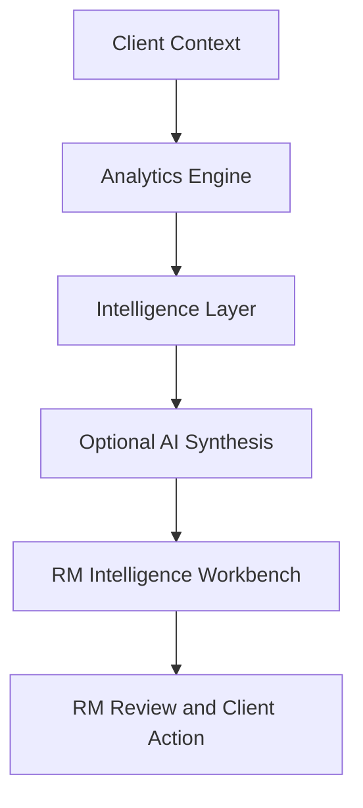

# RM Intelligence Workbench

An AI-powered wealth intelligence dashboard for Relationship Managers. The application turns portfolio data into explainable priorities, risk insights, event-based attribution, and client-ready advisory actions.

Built for SingHacks 2026 Hackathon

<p>
    
    
    
</p>

> [!IMPORTANT]
> All client, portfolio, transaction, market, and RM-note data in this repository is synthetic and intended for demonstration only.

## Features

- **Book Prioritizer**: Rank clients by urgency, risk, liquidity, mandate drift, and portfolio impact.
- **Client Deep-Dive**: Review portfolio history, market-event attribution, concentration, liquidity, and stress scenarios.
- **Advisory Action Hub**: Generate editable rebalancing, tax, life-event, and client communication suggestions.
- **AI Audit Log**: Track AI-generated recommendations and RM edits.
- **Explainable analytics**: Link portfolio movements to the authoritative `event_log.csv`.
- **Human-in-the-loop workflow**: Recommendations remain suggestions for RM review.

## Architecture

| Layer | Responsibility | Main implementation |
| :--- | :--- | :--- |
| <span style="color:#2563eb">**Client Context**</span> | Provides portfolio, mandate, risk, tax, goals, holdings, and event data. | `data/` |
| <span style="color:#16a34a">**Analytics Engine**</span> | Computes portfolio performance, LTV, liquidity, mandate drift, concentration, P&L, and event attribution. | `src/analytics.py` |
| <span style="color:#d97706">**Intelligence Layer**</span> | Combines deterministic analytics into monitoring, prioritisation, explanations, recommendations, and stress tests. | `engine/wealth_intelligence.py` |
| <span style="color:#7c3aed">**AI Synthesis**</span> | Generates grounded explanations and editable advisory drafts using supplied context and the authoritative event log. | `engine/llm_synthesis.py` and `src/ai_advisor.py` |
| <span style="color:#dc2626">**RM Workbench**</span> | Presents the book queue, client deep-dive, action hub, and audit log for human review. | `app.py` |



<table>
    <tr>
        <td bgcolor="#eff6ff"><strong>Monitor</strong><br>Detect portfolio and client risks.</td>
        <td bgcolor="#f0fdf4"><strong>Explain</strong><br>Connect movements to controlled event data.</td>
        <td bgcolor="#fff7ed"><strong>Recommend</strong><br>Prepare editable actions for RM review.</td>
    </tr>
</table>

## Requirements

- Python 3.10+
- pip
- Google Gemini API key for AI-generated synthesis

## Installation

```bash
git clone https://github.com/alvin20003030/singhack2026.git
cd singhack2026

python -m venv .venv
source .venv/bin/activate
pip install -r requirements.txt
```

On Windows:

```powershell
.venv\Scripts\activate
```

## Run the Application

```bash
streamlit run app.py
```

The application will open in your browser, usually at:

```text
http://localhost:8501
```

## Optional AI Configuration

The application works without an API key using deterministic analytics and fallback responses.

To enable Gemini-powered synthesis, edit the `.env` file in the project root:
```env
GEMINI_API_KEY=your_api_key_here
```

## Verify the Analytics Engine

Run the verification script to test data loading, portfolio summaries, LTV analysis, mandate drift, liquidity coverage, sustainability checks, priority scores, and event attribution:

```bash
python verify.py
```

A successful run ends with:

```text
=== ALL TESTS PASSED ===
```

## Project Structure

```text
.
├── app.py                         # Streamlit application
├── verify.py                      # Analytics verification script
├── requirements.txt               # Python dependencies
├── data/                          # Synthetic client and market data
├── engine/
│   ├── analytics.py               # Portfolio and risk calculations
│   ├── llm_synthesis.py           # Grounded AI synthesis boundary
│   └── wealth_intelligence.py     # Intelligence orchestration
├── src/
│   ├── ai_advisor.py              # Optional Gemini integration
│   ├── analytics.py               # Core analytics
│   ├── data_quality.py            # Data validation
│   └── scoring.py                 # Client prioritisation
├── docs/
│   └── DATA_DICTIONARY.md         # Dataset field definitions
└── starter/
    └── quickstart.py              # Dataset exploration script
```

## Dataset

All files in `data/` contain synthetic client, portfolio, transaction, market, and relationship-manager information.

Important files include:

| File | Description |
| --- | --- |
| `clients.csv` | Client profiles, objectives, risk profiles, and tax domiciles |
| `portfolios.csv` | Portfolio and mandate information |
| `holdings.csv` | Positions across five dated snapshots |
| `instruments.csv` | Instrument metadata and underlying references |
| `mandates.csv` | Allocation bands and concentration limits |
| `transactions.csv` | Trades, income, fees, and capital activity |
| `credit_facilities.csv` | Lombard and term-loan information |
| `commitments.csv` | Private-market commitments |
| `planned_cash_needs.csv` | Expected client cash requirements |
| `market_context.csv` | Market levels at each snapshot |
| `event_log.csv` | Authoritative 2026 market and geopolitical events |
| `rm_notes.json` | Relationship-manager notes and client context |

Field definitions are available in [`docs/DATA_DICTIONARY.md`](docs/DATA_DICTIONARY.md).

## Data and Governance

- The dataset is entirely synthetic.
- `event_log.csv` is the authoritative source for events.
- AI responses must be grounded in supplied analytics and source records.
- Recommendations are advisory suggestions and require RM review.
- The system is intended to support, not replace, regulated wealth-advisory processes.

## Snapshot Dates

The holdings data contains five portfolio snapshots:

- `2025-12-31`: Baseline
- `2026-02-27`: Before the Middle East conflict
- `2026-03-31`: After the Strait of Hormuz closure
- `2026-06-30`: After the technology drawdown
- `2026-08-26`: Current snapshot

Comparing snapshots is essential for understanding portfolio changes over time.

## Typical Workflow

1. Open the **Book Prioritizer**.
2. Identify clients with urgent or review-level actions.
3. Open a client’s deep-dive.
4. Review portfolio changes and event-log attribution.
5. Check liquidity, mandate drift, concentration, and stress scenarios.
6. Generate an advisory action.
7. Review and edit the recommendation before client communication.
8. Record the final decision in the audit log.

## License

This project was created for SingHacks 2026 and uses synthetic data for demonstration purposes.
